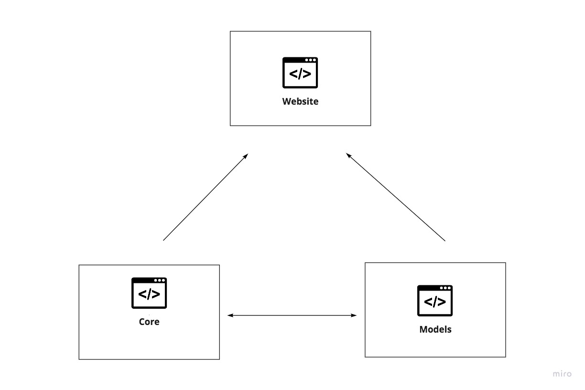

# JonDJones.Umbraco.V9.StarterKit  :heart_eyes: - By JONDJONES.COM

This is a .NET COre Umbraco V9 Stater kit.  Use this project to learn how to buid enterprise-level projects using Umbraco CMS.  Learn more about me or Umbraco then either visit my website [www.jondjones.co.uk](www.jondjones.co.uk) or check subscribe to my [YouTube channel](https://studio.youtube.com/channel/UCc7FlFtsxY1gLxp1PFf-gqA).

:star: **Don't forget to star this app as it's updated frequently** :star:

This is an open-source repo.  If you would like to add something or correct a mistake, please open a PR.

## :rocket: Getting Started

1. Rstore DB from data folder
2. Login on `/umbraco` with :

|Password          | Email                      |
|------------------|----------------------------|
|passwordpassword  | jon@jondjones.com |

Umbraco v9 start kiter

# Architecture

- Website: Webroot, Umbraco, images, aseets, etc..

- Core: For custom code

- Model: For Umbraco model builder code

- Database:  Find the  sites database

# Useful Links

- [Install Umbraco V9 In Visual Studio (And Debug Some Issues)](https://www.jondjones.com/learn-umbraco-cms/umbraco-9-tutorials/getting-started-with-umbraco-9/install-umbraco-v9-in-visual-studio-and-debug-some-issues/)

- [Umbraco V9 Project Structure And Best Practices](https://www.jondjones.com/learn-umbraco-cms/umbraco-9-tutorials/getting-started-with-umbraco-9/umbraco-v9-project-structure-and-best-practices/)
